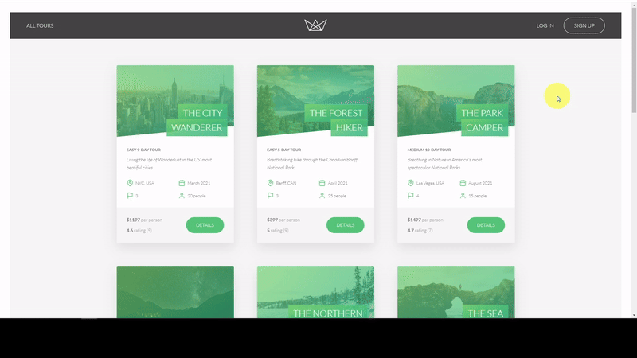
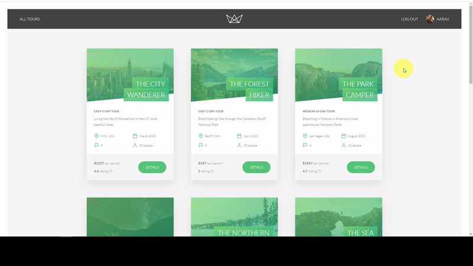

<h1 align="center">
  
</h1>
<h4 align="center">Demo tours booking website built on top of <a href="https://nodejs.org/en/" target="_blank">NodeJS</a>.</h4>

## Key Features 📝

- Authentication and Authorization
  - Sign up, Log in, Logout, Update, and reset password.
- User profile
  - Update username, photo, email, password, and other information
  - A user can be either a regular user or an admin or a lead guide or a guide.
  - When a user signs up, that user by default regular user.
- Tour
  - Manage booking, check tour map, check users' reviews and rating
  - Tours can be created by an admin user or a lead-guide.
  - Tours can be seen by every user.
  - Tours can be updated by an admin user or a lead guide.
  - Tours can be deleted by an admin user or a lead-guide.
- Bookings
  - Only regular users can book tours (make a payment).
  - Regular users can not book the same tour twice.
  - Regular users can see all the tours they have booked.
  - An admin user or a lead guide can see every booking on the app.
  - An admin user or a lead guide can delete any booking.
  - An admin user or a lead guide can create a booking (manually, without payment).
  - An admin user or a lead guide can not create a booking for the same user twice.
  - An admin user or a lead guide can edit any booking.
- Reviews
  - Only regular users can write reviews for tours that they have booked.
  - All users can see the reviews of each tour.
  - Regular users can edit and delete their own reviews.
  - Regular users can not review the same tour twice.
  - An admin can delete any review.
- Credit card Payment

## Demonstration 🖥️

#### Overview page :

#### Tour exploring page :

#### Tour booking :

#### User Profile :

#### Admin Profile :

## Build With 🏗️

- [NodeJS](https://nodejs.org/en/) 
- [Express](http://expressjs.com/) 
- [Mongoose](https://mongoosejs.com/) 
- [MongoDB Atlas](https://www.mongodb.com/cloud/atlas)
- [Pug](https://pugjs.org/api/getting-started.html) 
- [JSON Web Token](https://jwt.io/) 
- [ParcelJS](https://parceljs.org/) 
- [Stripe](https://stripe.com/) 
- [Postman](https://www.getpostman.com/) 
- [Sendgrid](https://sendgrid.com/) 

## Acknowledgement 🙏🏻

- This project is part of the online course I've taken at Udemy. Link to the course: [Node.js, Express, MongoDB & More: The Complete Bootcamp](https://www.udemy.com/course/nodejs-express-mongodb-bootcamp/)
